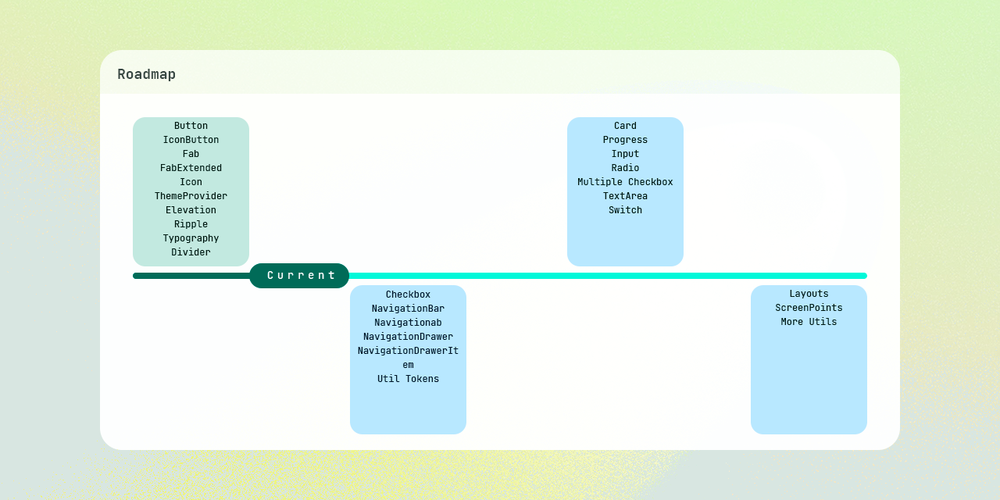

# material-anti-mage-vue

<div align="center">


Material Anti-Mage Vue

</div>

Material Anti-Mage Vue提供易于使用的简单Vue组件，提供完善的类型支持，基于Vue3和TypeScript。

借助第三方库[`@material/material-color-utilities`](https://github.com/material-foundation/material-color-utilities)，轻易地创建一套符合规则的配色方案，每一个组件遵循[`Material Design 3`](https://m3.material.io/)的设计原则，同时此项目尽可能地确保每一个组件符合[规范](https://www.w3.org/TR/wai-aria-1.2/#abstract)。

激动人心的一刻，我们上传了[Material Anti-Mage](https://anti-mage.web.app)作为我们的项目官网。 _官网受到Firebase的计划与费率限制。_

## 线路图



## 贡献指南

### 代码风格
项目的代码风格配置已经配置好了（您们可以在保持原代码风格上改进配置文件）。如果您要修改代码风格配置文件，请编辑`.eslintrc.cjs`，我们不建议修改`./.vscode/`中的`settings.json`文件，至少不要关闭`保存文件时执行代码格式化`。

如下列表为**必须遵守**的：
+ 不要使用分号（任何情况下）
+ 使用LF作为换行（此约定由git控制）
+ 组件文件的文件名单词首字母大写(例如`IconButton.type.ts`)
+ 组件坐在的文件夹的文件夹名称全小写(例如`icon-button`)
+ 位于`./src/utils/`的文件的文件名全小写(例如`change-theme.ts`)

如下列表为**可以不遵守**的：
+ 函数、变量、属性的定义下一行留出空行
+ 类型定义不要有逗号
+ 对象的属性尾随逗号

### 项目文件结构
关于组件的原始文件位于`./src/components/*`，请通过别名`@/components`访问。

每一个组件提供如下文件，请通过`npm run template`创建模板。

|File Name|Description|
|:--|--:|
|index.ts|导出组件|
|./internal/*.render.tsx|提供组件的原始代码|
|./internal/*.type.ts|提供组件的类型|
|./internal/*.styles.ts|提供组件的样式|
|./internal/*.tokens.ts|提供组件的样式的令牌|

### 创建组件
创建组件前您需要确保您已下载项目依赖
```
npm i
```

创建组件命令将会在`./src/components/`中创建一个文件夹，文件夹名称和文件夹内部的文件的创建完全通过脚本完成。当您输入如下命令后，控制台将会等待您键入组件的名称。
```
npm run template
```

现在您可以定位到`./src/components/`中并查看刚才创建好的模板代码。

### 编写props、slots、emits、styles
通过命令创建模板代码后（假设您通过命令创建了Button组件），您会在`./src/components/Button`文件夹中看到如下文件：
+ Button.render.ts
+ Button.type.ts
+ Button.styles.ts
+ Button.tokens.ts

请您转到其他代码做参考。

#### props
对应`Button.type.ts`文件的props部分。所有的外部属性都应该编写在此处。

如下代码示例展示了一个Button组件的disabled属性的定义（您必须要指定属性的默认值、类型，type属性的类型必须显式地转换为PropType）：
```typescript
import { props } from './Button.type'

export const renderButton = defineComponent({
    // 注意此处导入props
    props,
    // ...
})
```

```typescript
import { PropType } from 'vue'

export const props = {

    // 在此处定义props
    disabled: {
        default: false,
        type: Boolean as PropType<boolean>
    },

}
```

#### slots
对应`Button.type.ts`文件的slots部分。所有的插槽都应该编写在此处。

如下代码示例展示了一个默认插槽和一个具名插槽（请确保大多数情况下默认插槽和所有其他插槽为可选的）：
```typescript
import { slots } from './Button.type'

export const renderButton = defineComponent({
    // 注意此处导入slots
    slots,
    // ...
})
```

```typescript
import { SlotsType } from 'vue'

export const slots = Object as SlotsType<{
    
    // 此处定义默认插槽
    default?: void

    // 其他插槽
    icon?: void

}>
```
#### emits
对应`Button.type.ts`文件的emits部分。所有的事件都应该编写在此处。

```typescript
import { emits } from './Button.type'

export const renderButton = defineComponent({
    // 注意此处导入emits
    emits,
    // ...
})
```


```typescript
export const emits = [
    // 此处定义自定义的事件
    'click'
]
```
#### styles
对应`Button.styles.ts`文件的sharedButtonStyles部分。像height、width、color这些应该提供自定义的属性应该抽象到`Button.tokens.ts`中。

如下代码展示了可以由外部CSS自定义的样式：
```typescript
import { buttonTokens, buttonTokensExtern } from './Button.tokens'

export const sharedButtonStyles = StyleSheet.create({

    // 此处编写根样式
    root: {

        // 此处编写样式
        [buttonTokens.height]: `var(${buttonTokens.height}, var(${buttonTokens.height}))`,
        [buttonTokens.width]: `var(${buttonTokens.width}, var(${buttonTokens.width}))`,

    },

})
```

```typescript
import { makeComponentExternTokens, makeComponentTokens } from '@/utils/tokens'

// 假设您的Button组件抽象了高度和宽度
const tokens = [
    'width',
    'height',
] as const

export const buttonTokens = makeComponentTokens<typeof tokens>(
    // 此处的参数表示您的组件的名称，请保持全小写，多个单词使用-分割
    'button',
    tokens
)
export const buttonTokensExtern = makeComponentExternTokens<typeof buttonTokens>(buttonTokens)
```

### 导出组件
请在index.ts中**导出render和tokens**。在导出render时请起别名。如下代码示例假设您编写了一个render，将它导出的代码为：
```typescript
// 假设这是您自己编写的一个Button组件，其名称为renderButton。
export const renderButton = defineComponent({
    // ...
})
```

```typescript
/* 
 * 导出您自己编写的renderButton组件，您需要起别名。
 * 名称是在renderButton基础上移除render
 *   e.g.
 *     renderButton -> Button
 *     renderIcon -> Icon
 */
export { renderButton as Button } from './internal/Button.render'

/**
 * 除了导出必要的组件外，您还需要导出组件对应的tokens
 */
export * from './internal/Button.tokens'
```

### 设计指导
请确保您的代码遵循了MD3的spec部分。

[Material Design 3](https://m3.material.io/)
